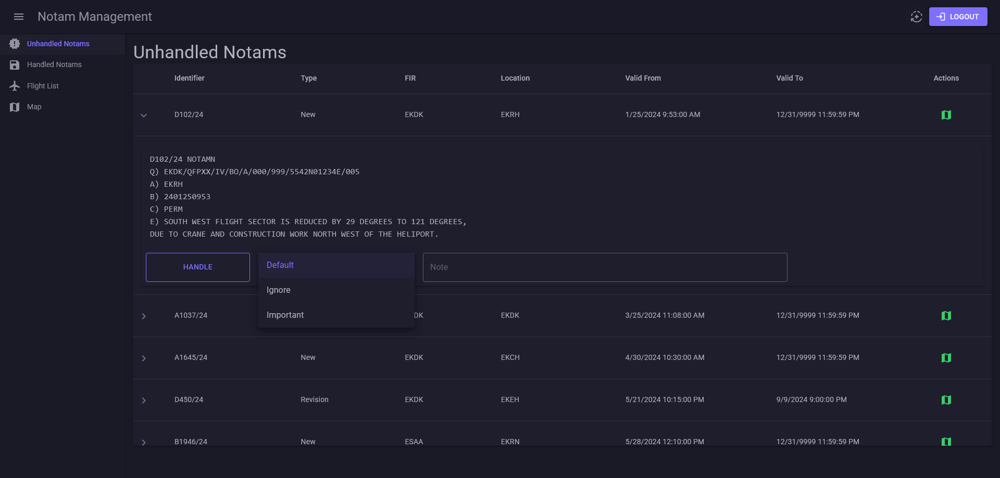
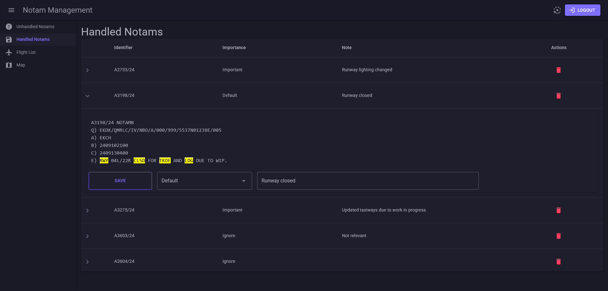
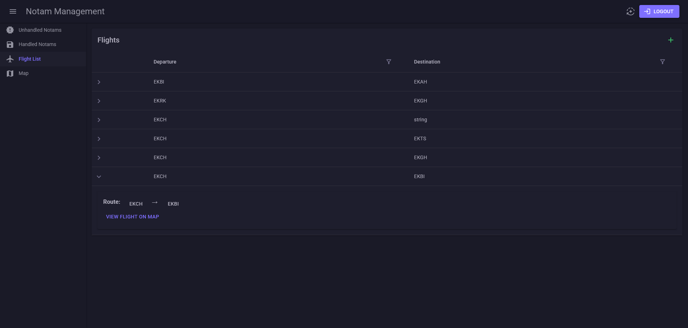
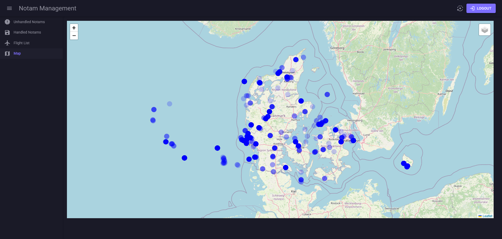

# NotamManagement
Notam Management Project in collaboration with [AIRSUPPORT A/S](https://ppsflightplanning.com/).

## The project

Often, many of the issued NOTAMs are irrelevant to a specific flight. For example, some may concern military flights or certain aircraft types, while others are more general. Pilots, especially on smaller flights like charters, waste time reviewing irrelevant information, which can lead to missed or misunderstood important messages. Pilots have a short briefing before the flight, usually taking 15-30 minutes, during which they review NOTAMs. On a 3-hour flight, there can be about 30 pages of NOTAMs, with 10-15 per page. Pilots have no chance to read all of them. Therefore, there is a need for an intelligent system that filters NOTAMs by relevance, type, and airspace.

## The product

